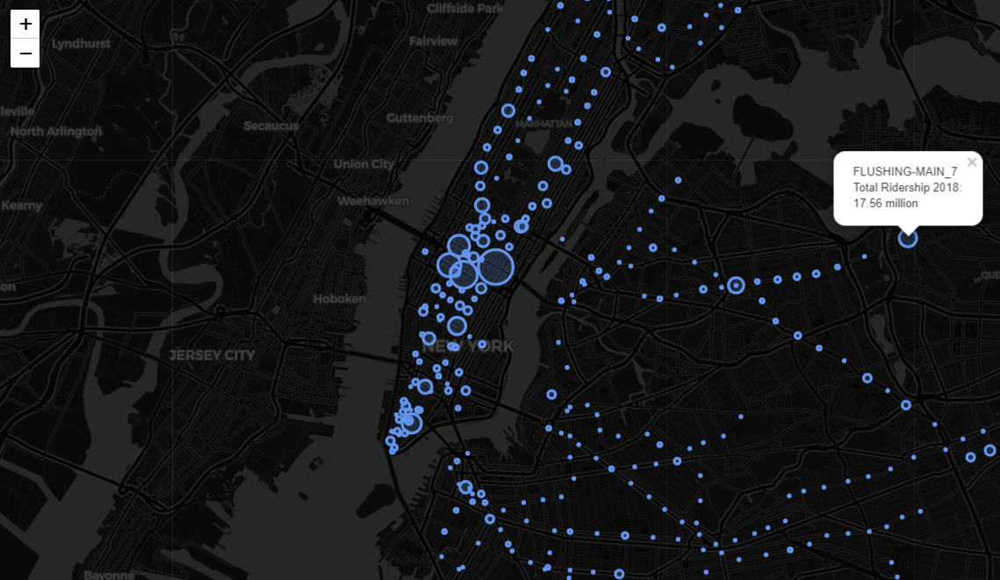

# **NYC Subway Ridership**

## Project Description
Oh the subway! The pride and joy of New York City...

This project scrapes subway turnstile information from the MTA's API and ouputs the top 15 stations in terms of entry traffic (called ridership in the project) in 2018, provides an interactive map of traffic for each subway station in NYC, and predicts 2019 ridership via Prophet time series modeling.

Below is an image of the map available in the jupyter notebook.

## Tools
Python 3
- Pandas
- Seaborn
- Folio
- Prophet

## Findings
[Forecasting NYC Subway Ridership - Jupyter Notebook](https://github.com/cartney06/Data-Science-Projects/blob/master/NYC%20Subway%20Ridership/NYC%20Subway%20Forecast.ipynb) 

To view the full notebook with the interactive map, visit the link here:

[Forecasting NYC Subway Ridership - Jupyter Notebook on nbviewer](https://nbviewer.jupyter.org/github/cartney06/Data-Science-Projects/blob/master/NYC%20Subway%20Ridership/NYC%20Subway%20Forecast.ipynb)

